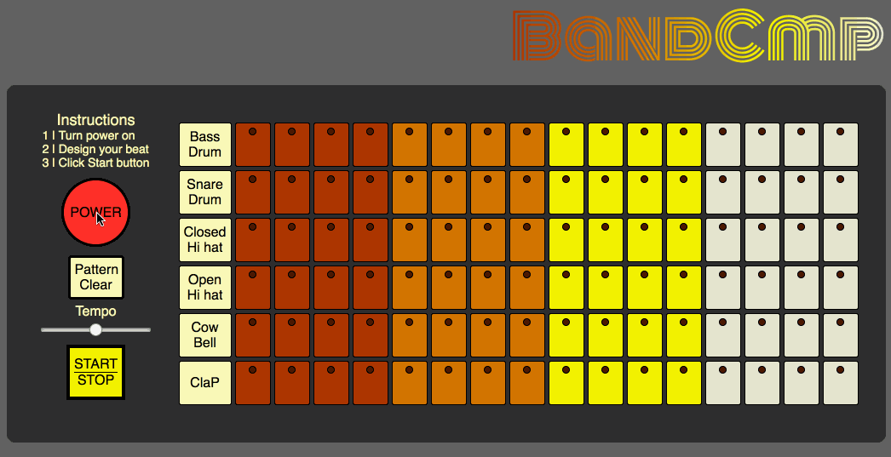

# BandCmp

[BandCmp][bandcmp live]

BandCmp is an interactive drum machine loosely inspired by the famous [Roland TR-808][roland link]. It utilizes JavaScript, jQuery, HTML5, and CSS3. Users can design their own drum beats and play them through their speakers or headphones.

## Features and Implementation
Users are required to power on the machine, select beats they want to play, and start the loop.



### Buttons
The buttons are created and `jQuery` `.hasClass .toggleClass .children` methods are used to turn classes `on` for buttons and leds. This allows the `DrumLoop` to determine if the beat should be played.

```        
$beat.click(() => {
  if ($(".power").hasClass('on')) {
    $beat.toggleClass('on');
    $beat.children().toggleClass('on');
    let audio = SOUNDS[i];
    if ($beat.hasClass("on")) {
      audio.play();
    }
  }
});
```

### DrumLoop

The DrumLoop uses `jQuery` `.addClass` method to activate the column which allows the user to follow the position of the buttons being played.

```
let column = $(`li.col${this.currentNote}`);
  column.addClass('active');
  setTimeout(() => column.removeClass('active'), bpm);

  for (let i = 0; i < column.length; i++) {
    let audio = $(column[i]);
    if (audio.hasClass('on')) {
      let sound = SOUNDS[i];
      this.stopPlay(sound);
      sound.play();
    }
  }
```

## Future Directions of Project
In addition to the features already implemented, there are several features below that I will work on in the future.

### Recording and Exporting
To create the ability to record and export a refactor to the Web Audio API will be necessary.

### Volume Knobs
Implementing volume adjustments for each instrument and a master volume. This will require a refactor using the Web Audio API.


[bandcmp live]: ccomings.github.io/bandcmp
[roland link]: https://en.wikipedia.org/wiki/Roland_TR-808
